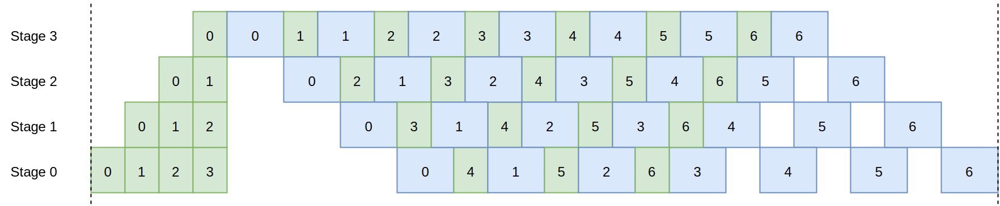
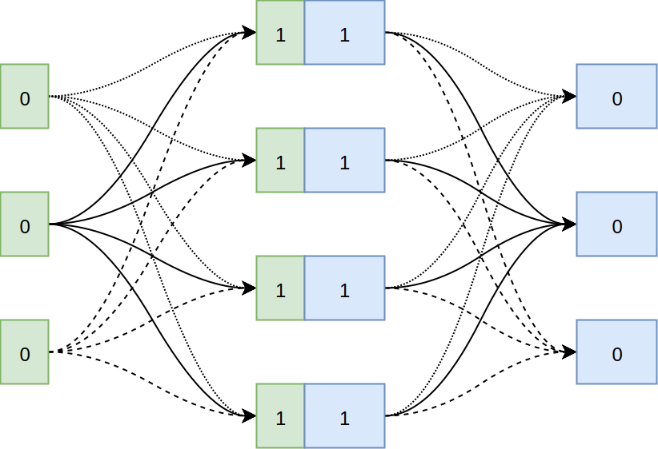
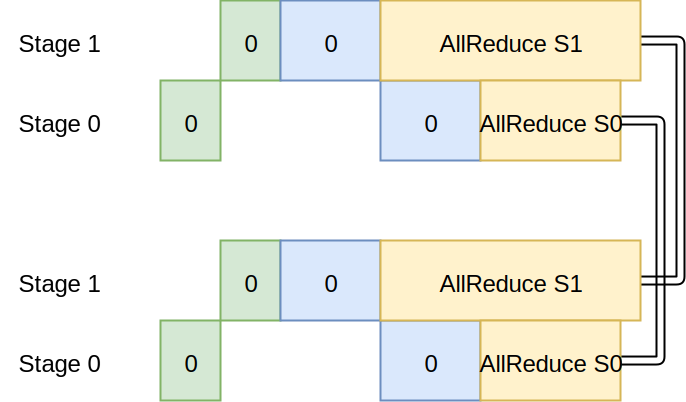
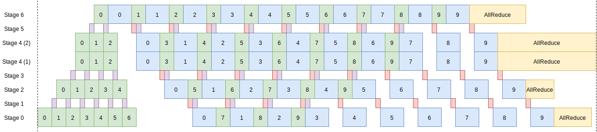
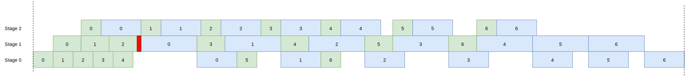
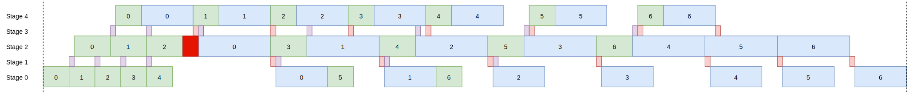
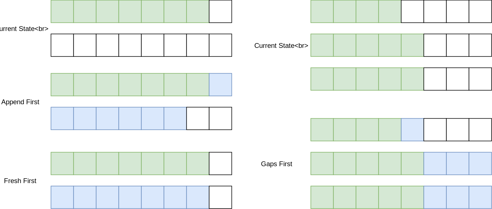
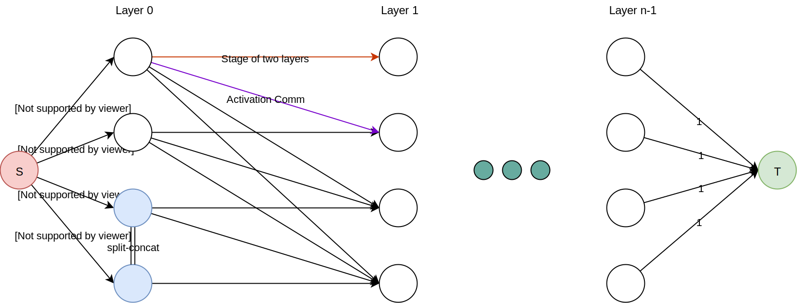

title: Hybrid Parallelism Global Orchestration
speaker: 荣懿
url: https://rongyi.io
prismTheme: solarizedlight
plugins:
    - echarts: {theme: infographic}
    - mermaid: {theme: forest}
    - katex

<slide class="bg-apple aligncenter">

# 混合并行全局规划 {.text-shadow}
Hybrid Parallelism Global Orchestration {.text-intro.animated.fadeInUp.delay-500 .text-shadow}

<br /><br /><br /><br /><br /><br />

> 荣懿 [\<rongyi.io\>](https://rongyi.io)

Link to this presentation [```http://11.167.226.167:7664/HPGO```](http://11.167.226.167:7664/HPGO)  
Contact [```hi@rongyi.io```](mailto:hi@rongyi.io) or [```rongyi.ry@alibaba-inc.com```](mailto:rongyi.ry@alibaba-inc.com)
<!--[:fa-link: Github](https://github.com/ksky521/nodeppt){.button.ghost.animated.flipInX.delay-1200}-->

<slide class="size-60 aligncenter text-apple">

## Outline

---

### 0. Intro \& Notations {.text-shadow .animated.fadeInUp}  
### 1. Parallelisms {.text-shadow .animated.fadeInUp}  
### 2. Sub-Problems {.text-shadow .animated.fadeInUp}  
### 3. The Algorithm {.text-shadow .animated.fadeInUp}  
### 4. Correctness & Complexity {.text-shadow .animated.fadeInUp}  
### 5. Future Improvements {.text-shadow .animated.fadeInUp}  

<slide class="bg-apple aligncenter">

# Introduction \& Notations

<slide class="aligncenter text-apple">

## Input
:::column {.vertical-align}

#### Model Structure

	* Forward \& Backward Computation Time
	* Activations Output Size
	* Parameter Size

--- 

#### Environment
	- Cluster network topology
	- Intra-machine GPU topology
	- Interconnect speed btw any two machines

---
	
#### Hyper-Parameters
	- Desired global batch size
	- Profiling batch size
	- Allowed minimum micro batch size

<slide class="aligncenter text-apple">
## Output

#### The fastest way to train the model in the specified environment

:::column {.vertical-align}

The algorithm should plan for:

- Data Parallelism
- Model Parallelism
- Pipeline
- Split-Concat

---

Under these constraints:

- Synchronous Training
- Global Batch Size from Input
- Reasonable micro batch size
- Memory usage under device threshold

<slide class="bg-apple aligncenter">

# Parallelisms {.text-shadow}

#### | Data Parallel | Split-Concat | Synchronous Pipeline | 

<slide class="aligncenter text-apple">

### Synchronous Pipeline (1)

Inside a pipeline, the forward/backward computation blocks are arranged in a deterministic way to 
minimize peak activation memory. The following illustration showcases a example pipeline where network effects are negligible.

---




<slide class="aligncenter text-apple size-80">

### Split-Concat


<slide class="text-apple">

### Calculations relevant to the algorithm {.aligncenter}

| Name | Formula |
| :--- | :---: |
| Activation for stage $i-1$ | $A_{{i-1}}$ |
| Time estimated to transfer the activation | $A_{i-1} / B_{i-1 \to i}(A_{i-1})$ |
| Replication factor for stage $i-1$ | $R_{{i-1}}$ |
| Replication factor for stage $i$ | $R_i$ |

#### Estimated Transfer Time from stage $i-1$ to $i$
$$max_{x=0}^{R_{i-1}}\ max_{y=0}^{R_i}\ \left\{\begin{array}{lr}
        	\frac{(A_{s-1}/(R_{i-1} \times R_i))}{B_{x \to y}(A_{s-1}/(R_{i-1} \times R_i))}
        \end{array}\right\}$$

#### In 2-level networking setup
$$(A_{i-1}/(R_{i-1} \times R_i)) / B_{eth}(A_{i-1}/(R_{i-1}\times R_i))$$

<slide class="text-apple">

### Data Parallel {.aligncenter}

--- 

#### Data Parallelism is only used at the outermost level
#### Each stage in inner pipelines do AllReduce independently

<slide class="aligncenter text-apple">


<slide class="text-apple">
### Calculations relevant to the algorithm {.aligncenter}

| Name | Formula |
| :--- | :---: |
| Size of Data Communication | $\frac {{2 \times W_s \times R_P}} {{R_P-1}}$ |
| Time needed for AllReduce | $\frac{2 \times W_s \times (R_P-1)}{R_P \times B_{slowest}(2 \times W_s \times  \frac{R_P-1}{R_P})}$ |

<slide class="aligncenter text-apple">

### Synchronous Pipeline (2)

For situations where network problems are likely to be bottlenecks, we arrange network activity as a separate pipeline stage.

---



<slide class="text-apple">

### Calculations relevant to the algorithm {.aligncenter}

#### Length of a single pipeline

$$PL = \max_{0 \le i < S,\ i\ \%\ 2 == 0} \{(mBatch \times (FW[Q] + BW[Q]) + \sum_{k=0}^{Q-1}{(FW[k] + BW[k])}) - \sum_{s=0}^{i-1} BW[s] + \frac{2 \times W_i \times (R_P-1)}{R_P \times B_{slowest}(2 \times W_i \times \frac{R_P-1}{R_P})} \}$$

$$PL = (mBatch \times (FW[Q] + BW[Q]) + \sum_{k=0}^{Q-1}{(FW[k] + BW[k])}) + \max_{0 \le i < S,\ i\ \%\ 2 == 0} \{ \frac{2 \times W_i \times (R_P-1)}{R_P \times B_{slowest}(2 \times W_i \times \frac{R_P-1}{R_P})} - \sum_{s=0}^{i-1} BW[s] \}$$ 

#### Computation Blocks count

$$CB = \sum_{0 \le i < S,\ i\ \%\ 2 == 0} mBatch \times (FW[i] + BW[i])$$

#### Pipeline Efficiency
$$\frac{CB}{PL * \lceil S / 2 \rceil}$$

<slide class="aligncenter text-apple">

### Synchronous Pipeline (3)




<slide class="aligncenter text-apple">
### Updated Calculations for Pipeline Length {.aligncenter}

$$PL= (mBatch \times (FW[Q] + BW[Q]) + \sum_{k=0}^{Q-1}{(FW[k] + BW[k])}) + (\sum_{k=Q+1}^{S}{(FW[k]+BW[k])} - (S-Q) \times FW[Q]) + \max_{0 \le i < S,\ i\ \%\ 2 == 0} \Bigg\{ \frac{2 \times W_i \times (R_P-1)}{R_P \times B_{slowest}(2 \times W_i \times \frac{R_P-1}{R_P})} - \bigg[(i\le Q)\ ?\ (\sum_{s=0}^{i-1} BW[s])\ :\ (\sum_{s=0}^{Q-1} BW[s] + (S-i+1) \times BW[Q]) - \sum_{s=Q+1}^{i}{FW[i]} - BW[i]\bigg] \Bigg\}$$

<slide class="bg-apple aligncenter">

# Sub-Problems {.text-shadow}

#### Variants 1 - 8 

<slide class="text-apple size-60 aligncenter">

## Var.1: 

#### Asynchronous, No-Replication, No-Networks, No-Placement {.aligncenter}
##### Assume the following to simply the problem to the extreme
- the pipeline runs forever without needing to synchronize
- we do not have any replication whatsoever
- communications are negligible compared to computations
- once the split is determined, we magically have the optimal placement
- we only have one pipeline, without any outer DP.

<slide class="text-apple">

### Problem Reduction {.aligncenter}

> Given a model and its profiling results, along with the number of workers, what's the best way to partition the model so that **the pipeline runs the fastest**? {.text-quote}

> Given a model and its profiling results, along with the number of workers, what's the best way to partition the model so that the **slowest stage in the pipeline is the fastest**? {.text-quote}

> Given an array of $n$ numbers, find a partition solution so that the array is splitted into $k$ parts, and the maximum of the $k$ sums (by adding elements of each subarray together) is minimized.{.text-quote}

<slide class="text-apple">

:::column {.vertical-align}

## Example {.text-shadow}
# A = [ 1, 4, 2, 3, 5 ]
# K = 3

---

# 1 4 | 2 3 | 5 $\rightarrow$ max = 5
# 1 | 4 2 | 3 5 $\rightarrow$ max = 8
# 1 4 2 | 3 | 5 $\rightarrow$ max = 7

<slide class="text-apple">

### Solution to this subproblem
Define $dp[i][j]$ as the slowest stage time when splitting the first $i+1$ layers into $j$ stages, assuming the split is already optimal.

#### The State Transition Function
$$dp[i][j] = \min\{\max_{p=0}^{i}\{dp[i][1]-dp[p][1],dp[p][j-1]\}\}$$

#### Solve $dp[n][k]$ to get the solution
$$dp[n][k] = \min_{i=1}^n\{\min_{j=1}^k\{\max_{p=0}^i\{dp[i][1]-dp[p][1],dp[p][j-1]\}\}\}$$

<slide class="text-apple aligncenter">

#### Time Complexity
### $O(n^2 \times k)$ {.text-data}

#### Space Complexity
### $O(n \times k)$ {.text-data}


<slide class="text-apple size-60 aligncenter">

## Var.2: 

#### Asynchronous, No-Networks, No-Placement {.aligncenter}
##### Loosen the restriction on replication, still assumes

- the pipeline runs forever without needing to synchronize
- communications are negligible compared to computations
- once the split is determined, we magically have the optimal placement
- we only have one pipeline, without any outer DP.

<slide class="text-apple">

### Problem Reduction {.aligncenter}

> Given a model and its profiling results, along with the number of workers, what's the best way to partition the model into stages and optionally replicate certain stages, so that the **slowest stage in the pipeline is the fastest**? {.text-quote}

> Given an array of $n$ numbers, find a partition so that the array is splitted into $m$ parts ($m \le k$), and assume each subarray has a weight of a natural number such that the weights of all subarrays added together is $k$. We add each subarray elements to get $m$ sums, find the solution when the maximum of those $m$ sums is minimized.{.text-quote}

<slide class="text-apple">

### Solution to this subproblem
This problem is different from the last one in a sense that the split is not necessarily $k$. So the original brute force solution still work in exponential time, but the binary search solution in $O(n \times k)$ will no longer work.

Define $dp[i][j]$ as the slowest stage time when splitting the first $i+1$ layers into stages with $j$ machines, assuming the split is already optimal.


#### The State Transition Function
$$dp[i][j] = \min_{0<i'<i}\min_{0<j'<j}\ \max\ \left\{\begin{array}{lr}
        	\frac{dp[i][1] - dp[i'][1]}{j'} \\
        	dp[i'][j-j']
        \end{array} \right .$$

#### Solve $dp[n][k]$ to get the solution
$$dp[n][k] = \min_{i=1}^n\min_{j=1}^k\min_{0<i'<i}\min_{0<j'<j}\ \max\ \left\{\begin{array}{lr}
        	\frac{dp[i][1] - dp[i'][1]}{j'} \\
        	dp[i'][j-j']
        \end{array} \right .$$

<slide class="text-apple aligncenter">

#### Time Complexity
### $O(n^2 \times k^2)$ {.text-data}

#### Space Complexity
### $O(n \times k)$ {.text-data}

<slide class="text-apple size-60 aligncenter">

## Var.3: 

#### Asynchronous, No-Placement {.aligncenter}
##### We added the constraints on networks, but still assume the following:

- the pipeline runs forever without needing to synchronize
- once the split is determined, we magically have the optimal placement
- we only have one pipeline, without any outer DP.

---

This problem is now equivalent to what **PipeDream's Optimizer** tries to solve

<slide class="text-apple">

### Problem Reduction {.aligncenter}
We still define the number of stages as $n$ and the number of workers as $k$. Assume computation for each stage is $C[]$, and activation input and output are $A_i[]$ and $A_o[]$. This problem is then equivalent to:

> Given an array of $n$ numbers, find a partition so that the array is splitted into $m$ parts ($m \le k$), and assume each subarray has a weight of a natural number such that the weights of all subarrays added together is $k$. For each elements in the array, the value is then recalculated to be the largest among computation times and communication time, and then we add each subarray elements to get $m$ sums. Find the solution when the maximum of those $m$ sums is minimized.{.text-quote}

<slide class="text-apple">

### Solution to this subproblem
This is almost the same as the last one, except for calculating the max.


#### The State Transition Function
$$dp[i][j] = \min_{0<i'<i}\min_{0<j'<j}\ \max\ \left\{\begin{array}{lr}
        	\frac{dp[i][1] - dp[i'][1]}{j'} \\
        	dp[i'][j-j'] \\
        	A_i[i'] + A_o[i']
        \end{array} \right .$$

#### Solve $dp[n][k]$ to get the solution
$$dp[n][k] = \min_{i=1}^n\min_{j=1}^k\min_{0<i'<i}\min_{0<j'<j}\ \max\ \left\{\begin{array}{lr}
        	\frac{dp[i][1] - dp[i'][1]}{j'} \\
        	dp[i'][j-j'] \\
        	A_i[i'] + A_o[i']
        \end{array} \right .$$

<slide class="text-apple aligncenter">

#### Time Complexity
### $O(n^2 \times k^2)$ {.text-data}

#### Space Complexity
### $O(n \times k)$ {.text-data}


<slide class="text-apple size-60 aligncenter">

## Var.4: 

#### Synchronous, No-Placement, No-Network {.aligncenter}
##### We now enforce strictly synchronous training, but still assume the following:

- communications are negligible compared to computations
- once the split is determined, we magically have the optimal placement
- we only have one pipeline, without any outer DP.

<slide class="text-apple">

### Problem Reduction {.aligncenter}
In our case, a single pipeline length without out DP AllReduce operation can be calculated analytically. Assume the slowest stage is $Q$, then we have:

$$PL = mBatch \times (FW[Q] + BW[Q]) + \sum_{k=0}^{Q-1}{(FW[k] + BW[k])}$$

:::column {.vertical-align}

In order to minimize the overall running time of the pipeline, we just need to minimize the forward and backward computation time of Q, the longest stage in the pipeline. 

---

#### Therefore this subproblem is equivalent to "**Var.2: Asynchronous, No-Networks, No-Placement**"

<slide class="text-apple">

### Solution to this subproblem
#### Same as Var.2

$$dp[n][k] = \min_{i=1}^n\min_{j=1}^k\min_{0<i'<i}\min_{0<j'<j}\ \max\ \left\{\begin{array}{lr}
        	\frac{dp[i][1] - dp[i'][1]}{j'} \\
        	dp[i'][j-j']
        \end{array} \right .$$

<slide class="text-apple aligncenter">

#### Time Complexity
### $O(n^2 \times k^2)$ {.text-data}

#### Space Complexity
### $O(n \times k)$ {.text-data}


<slide class="text-apple size-60 aligncenter">

## Var.5: 

#### Synchronous, No-Placement {.aligncenter}
For synchronous pipeline where network could potentially be a bottleneck, we arrange the network as if it's a separate stage independent from computation.

----

#### So this is equivalent to Var. 4


<slide class="text-apple size-60 aligncenter">

## Var.6: 

#### Synchronous, No-Placement, DP Extension {.aligncenter}
##### We now add outermost DP to extend the Pipelines

---

Since assigning different number of available workers to a pipeline drastically affect the pipeline arrangement, we have to enumerate all the possible DP solution up to $\lceil\sqrt{n}\rceil$.

The AllReduce operation needed for Data Parallel can start immediately after a stage has done its final backward computation. In terms of pipeline length, this would only add the time for AllReduce of stage 0 in best scenario. However, it is possible for AllReduce operations from other stages to block the finishing time of the entire pipeline.

<slide class="text-apple">

### Pipeline Length Calculation with DP {.aligncenter}
Assume the slowest stage is $Q$, then we have:

$$\max_{0 \le i < S,\ i\ \%\ 2 == 0} \{
        	(mBatch \times (FW[Q] + BW[Q]) + \sum_{k=0}^{Q-1}{(FW[k] + BW[k])}) - \sum_{s=0}^{i-1} BW[s] + \frac{2 \times W_i \times (R_P-1)}{R_P \times B_{slowest}(2 \times W_i \times \frac{R_P-1}{R_P})} \}$$

(1) takes the max across all the stages, and the $i \% 2$ is to filter out network stage  
(2) calculates the original pipeline length without AllReduce  
(3) normalizes to when the stage actually ends, and adds the AllReduce cost

<slide class="text-apple">
### Optimizing Enumeration
#### Pruning Unnecessary Configurations
While enumerating the possible configurations for DP extension, we first arrange the entire model without considering any DP extension with all the $k$ machines, and get a theoretical max speedup over single machine $sp$, and use this as a threshold for whether we will plan for certain configurations that does not use all the machines. 

#### Simultaneously consider Transpositions
For every DP configuration we try out, we also explore for its "transposed" configuration, meaning we will try 3x5 and 5x3 at the same time. 


<slide class="text-apple aligncenter">

#### Time Complexity
### $O(n^2 \times k^2 \times \sqrt{k})$ {.text-data}

#### Space Complexity
### $O(n \times k \times \sqrt{k})$ {.text-data}

<slide class="text-apple size-60 aligncenter">
## Var.7: 
#### Synchronous, BF Placement, DP Extension {.aligncenter}

---

> Once we have the placement for each stage, we only need to solve the subproblem stated in Var.6. Here we experiment on Brute Force Placement.{.text-quote}

<slide class="text-apple">
## Placement! {.aligncenter}
#### This is the complexity of a Naive Brute Force
$$\prod_{i=0}^s {(k - \sum_{j=0}^i {R_j}) \choose R_i} = \prod_{i=0}^s \frac{(k - \sum_{j=0}^i {R_j})!}{R_i ! \times (k - (\sum_{j=0}^i {R_j}) - R_i)!}$$

#### A Marginal Optimization
We can do better by assuming that every machine is equivalent and every graphics card inside a machine is equivalent, i.e. the entire system is composed of isomorphic components. If we have a cluster of M machines each with G graphics card, we can then cut the complexity down by at least $M! \times G!$, where $M\times G = k$.

<slide class="text-apple aligncenter">
	
#### The placement alone takes a time complexity of
### $BFF = O(\frac{\prod_{i=0}^s \frac{(k - \sum_{j=0}^i {R_j})!}{R_i ! \times (k - (\sum_{j=0}^i {R_j}) - R_i)!}}{k \times (M-1)!(G-1)!})$


<slide class="text-apple size-60 aligncenter">
## Var.8: 
#### Synchronous, Placement Heuristics, DP Extension {.aligncenter}
> DAPPLE Planner {.text-quote}

---

In our use cases, if we have a stage with more than 1 replica, the AllReduce speed can be estimated using the lowest bandwidth across these replicas, same for the calculation of Activation communication. Therefore, it is sufficient to consider device placement as the following three cases:

- **FF**(Fresh First): prioritize placing the entire stage on a fresh unused machine
- **AF**(Append First): prioritize placing the entire stage after an existing stage on a not yet fully occupied machine, even if this means the stage has to cross multiple machines
- **GF**(Gaps First): prioritize filling in the gaps on machines not yet fully utilized
- **SF**(Scatter First): prioritize spanning across all available machines

<slide class="text-apple aligncenter">


<slide class="text-apple size-80 aligncenter">
This would significantly cut down the space and time complexity to enumerate all the possible placement of stages. Assume we have $M$ machines each with $G$ graphics card, $M \times G = k$, then the total complexity for this process is strictly less than: 

$$O((2\times M)^s)$$

Along with DP extension enumeration and Device Rotation, the overall complexity without Single Pipeline Arrangement, is strictly less than:

$$O(\sum_{i=0}^{\lceil \sqrt{k} \rceil} (2 \times (\lceil M/i \rceil))^i)$$

Therefore the total complexity for this improved enum-based approach is
$$O(n^2 \times k^2 \times \sum_{i=0}^{\lceil \sqrt{k} \rceil} (2 \times (\lceil M/i \rceil))^i)$$

<slide class="bg-apple aligncenter">
## Search Space Pruning
#### Memory Constraints

#### Minimum Microbatch Size

#### Other Heuristics

<slide class="text-apple aligncenter">
### Peak Memory for Stage $i$
#### $2 \times W_i + (s-i+1) \times A_i \times \lceil \frac{GBS}{mBatch \times PBS} \rceil$

---


<slide class="text-apple aligncenter">
### Minimum MicroBatch Size
#### User Defined

### Maximum MicroBatch Size
$$2 \times W_i + (s-i+1) \times A_i \times \lceil \frac{GBS}{mBatch \times PBS} \rceil = 16GB$$

$$mBatchSize = 2 ** {\lfloor\log_2{\frac{(16GB - 2 \times W_i) \times PBS}{(s-i+1) \times A_i}}\rfloor}$$

<slide class="text-apple aligncenter">
### Other Heuristics
#### Prefer NVLink for AllReduce
#### Prefer NVLink for Split-Concat

<slide class="bg-apple aligncenter">
## The Current Algorithm
### HPGO v0.7
---
#### Full DP Algorithm
#### Complexity Analysis
#### Potential Badcases
#### Proof of Correctness


<slide class="bg-apple aligncenter">
## Full DP Algorithm


<slide class="text-apple aligncenter">
### Notations
#### dp[i][j][k][bset{}] {.text-data .text-shadow}
- $N$ layers, $K$ workers, $M$ machines each with $G$ GPUs
- $i$: Pipeline Replication Factor, from 1 to $\sqrt{{N}}$
- $j$: Layers, from 1 to $N$
- $k$: Workers, from 1 to $K$
- `bset{}`: BitSet indicating whether a worker is already occupied

<slide class="text-apple aligncenter">
### DP[i][j][k][bset{}]
Define DP[i][j][k][bset{}] as the current best pipeline arrangement as well as stage placement, for the first $j$ layers using $k$ workers (indicated by `bset{}`), replicated over $i$ pipelines.
DP[i][j][k][bset] records current longest stage time $FW[Q] + BW[Q]$ (just as variants 1-4), current estimated longest pipeline time $T_P$
### DP State Transition
#### $dp[i][j][k][bset\{\}] =$

$$\min_{0<j'<j}\min_{0<k'<k}\min_{bm \in bitmasks}
\left\{\begin{array}{lr}
\max\Bigg(mBatch \times \bigg(\max\ 
		\left\{\begin{array}{lr}
        	\frac{dp[j][1] - dp[j'][1]}{k'} \\
        	dp[i][j'][k-k'][bset \times bm(k')] \\
        	A_i[j'] + A_o[j'] \\
			FW[Q] + BW[Q]
        \end{array} \right .\bigg)
		 + \sum_{k=0}^{Q-1}{(FW[k] + BW[k])}) + \frac{2 \times W_{j' \to j} \times (i-1)}{i \times B_{slowest}(2 \times W_{j' \to j} \times \frac{i-1}{i})} - \sum_{s=0}^{j-1} BW[s]\Bigg) \\
		T_P
\end{array} \right .
$$

#### Solve for $dp[\lceil \sqrt{K} \rceil][N][K][bset\{1,...,1\}]$


<slide class="text-apple aligncenter">
### Space-Time Complexity
## $O(\sum_{k=0}^{\lceil \sqrt{K} \rceil} (4^{(\lceil K/k \rceil)}) \times N^2 \times K^3)$

<slide class="bg-apple aligncenter">
## Next Up
#### Priority-based Communication Scheduling
#### Minimum-Cost Max-Flow (MCMF)
#### Metropolis-Hastings

<slide class="text-apple aligncenter">
## Overview
#### Solve both Placement and Pipeline Arrangement together

$$PL = (mBatch \times (FW[Q] + BW[Q]) + \sum_{k=0}^{Q-1}{(FW[k] + BW[k])}) + \max_{0 \le i < S,\ i\ \%\ 2 == 0} \{ \frac{2 \times W_i \times (R_P-1)}{R_P \times B_{slowest}(2 \times W_i \times \frac{R_P-1}{R_P})} - \sum_{s=0}^{i-1} BW[s] \}$$ 

<slide class="text-apple aligncenter">
## MCMF Flow Construction


<slide class="text-apple aligncenter">
#### The Cost of MCMF
### $O(E \cdot V \cdot F)$
#### $V = k \times n$  
#### $E = k^2 \times n$  
#### $F = k \times n \times \frac{{GBS}}{{PBS}}$

#### So the overall complexity is
### $O(k^4 \times n^3)$

<slide class="aligncenter bg-apple">

## 。
